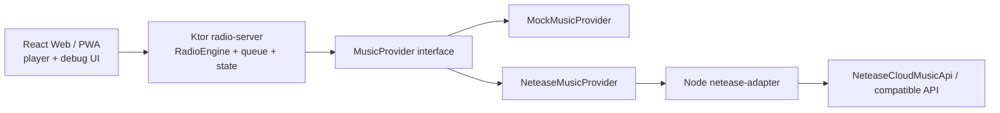

# Aftertaste FM

Aftertaste FM is a private AI radio for turning taste, context, and a small music provider into hosted listening sessions.<br>
Aftertaste FM 是一个私人 AI 电台，用你的音乐品味、当下环境和一个轻量音乐源，生成有主持人的收听节目。

It is not a playlist player that speaks before every track.<br>
它不是那种每首歌前都插一句话的歌单播放器。

It plans small radio segments: a calm AI host opens or transitions a mood, then several songs play together before the host returns.<br>
它会规划一段段电台章节：平静的 AI 主持人负责开场或转场，然后几首歌连续播放，之后主持人再回来。

The project is still in active development, but the core boundary is already deliberate: React is only the player surface, `radio-server` owns planning and state, and provider-specific behavior stays behind adapters.<br>
项目仍在积极开发中，但核心边界已经明确：React 只负责播放器界面，`radio-server` 负责规划和状态，音乐平台相关逻辑都放在 adapter 后面。

## What Runs Today<br>当前运行的组成

- `services/radio-server`: Kotlin + Ktor, the main radio brain and public API.<br>
  `services/radio-server`：Kotlin + Ktor，主要的电台大脑和公开 API。
- `apps/web`: React + TypeScript + Vite, a real player/debug surface.<br>
  `apps/web`：React + TypeScript + Vite，真实播放器和调试界面。
- `apps/netease-adapter`: Node + TypeScript, a thin provider adapter with mock data and optional external Netease API pass-through.<br>
  `apps/netease-adapter`：Node + TypeScript，一个很薄的音乐源适配器，支持 mock 数据，也可以转发到外部网易云接口。
- `docs`: architecture, API notes, and roadmap for future contributors and other agents.<br>
  `docs`：架构、API 说明，以及给未来贡献者和其他 agent 看的路线说明。

## Architecture<br>架构



React only talks to Ktor.<br>
React 只和 Ktor 通信。

Ktor owns the show plan, playback queue, host language, and future state.<br>
Ktor 负责节目计划、播放队列、主持人语言和后续状态。

The Node adapter is intentionally thin: it hides Netease-specific response shapes and returns Aftertaste FM's normalized `Track`, `StreamUrl`, and `Playlist` objects.<br>
Node adapter 刻意保持很薄：它隐藏网易云特有的返回结构，并返回 Aftertaste FM 统一格式的 `Track`、`StreamUrl` 和 `Playlist` 对象。

## AI Recommendation Shape<br>AI 推荐流程

The recommendation flow is built around a mock-first local path plus an optional runtime LLM planner:<br>
推荐流程以 mock-first 的本地路径为基础，并可选接入运行时 LLM planner：

1. Free-form chat goes through `POST /api/agent/chat`. When an `LLM_API_KEY` is set, an LLM router returns a structured `routingIntent` (language, energy, routine, mood tag, avoid list, artists, extra tags) plus `shouldPlan`.<br>
   自由聊天先经过 `POST /api/agent/chat`。配置了 `LLM_API_KEY` 时，LLM router 会输出结构化的 `routingIntent`（语言、能量、场景、情绪、避开列表、艺人、额外标签）以及 `shouldPlan`。
2. If `shouldPlan` is true, the web app calls `POST /api/chat` with the same message and the router's `routingIntent`, so candidate selection and planning use the same interpretation instead of re-extracting intent twice.<br>
   当 `shouldPlan=true` 时，网页端再以同样的消息和 `routingIntent` 调用 `POST /api/chat`，让候选筛选和规划复用同一份解读，而不是两次重新提取意图。
3. The recommendation context combines the routing intent, host config, taste profile, the current **station style** (daypart preset), time, optional weather, and recent listening signals.<br>
   推荐上下文会组合 routing intent、主持人配置、品味画像、当下的 **station style**（按时段切换的预设）、时间、可选天气和最近的收听信号。
4. `TasteProfileRepository` loads offline tagged tracks from `data/taste/`.<br>
   `TasteProfileRepository` 会从 `data/taste/` 读取离线标注过的歌曲。
5. `CandidateSelector` picks a small candidate pool, scoring by tag fit, language, energy gap vs the station target, night/coding fit, valence, and skip risk.<br>
   `CandidateSelector` 会挑出一个小候选池，按标签匹配、语言、和 station 能量目标的差值、夜间/编码适配度、情绪与跳过风险打分。
6. If there is no local taste pool, `MusicProvider` returns candidate tracks from mock data or Netease.<br>
   如果没有本地品味池，`MusicProvider` 会从 mock 数据或网易云返回候选歌曲。
7. `LlmShowPlanner` turns candidates into titled radio segments when a runtime LLM key is set, with the station's `hostStyle` injected into the system prompt.<br>
   配置了运行时 LLM key 时，`LlmShowPlanner` 会把候选歌曲组织成带标题的电台章节，并把当下 station 的 `hostStyle` 注入 system prompt。
8. It receives the selected candidate pool plus compact taste evidence, not the whole listening history.<br>
   它只接收已筛选的候选池和压缩后的品味证据，而不是完整收听历史。
9. `ShowPlanner` remains the deterministic fallback for the no-LLM-key path.<br>
   `ShowPlanner` 仍然作为没有 LLM key 时的确定性 fallback。
10. `PlaybackQueue` expands each segment into `HostVoiceItem(with lead Track) + TrackItem + TrackItem`.<br>
    `PlaybackQueue` 会把每个章节展开成 `HostVoiceItem(with lead Track) + TrackItem + TrackItem`。
11. The host can speak over the chapter lead's opening, then the rest of the chapter plays clean.<br>
    主持人可以压在章节 lead track 的开头说话，之后其余歌曲干净播放。
12. The API returns `agentTrace` so the web UI can show how the agent interpreted the request.<br>
    API 会返回 `agentTrace`，让网页端能看到 agent 如何理解这次请求。

## Station Style And Routing<br>电台时段风格与路由

`stationStyleFor(time)` maps the local hour to a daypart preset (`morning`, `afternoon`, `evening`, `late-night`, `deep-night`). Each preset carries a `hostStyle`, `energyTarget`, `nightWeight`, and `valenceWeight` used by both candidate selection and host script generation.<br>
`stationStyleFor(time)` 会把当下小时映射到 `morning`、`afternoon`、`evening`、`late-night`、`deep-night` 之一。每个预设都带有 `hostStyle`、`energyTarget`、`nightWeight`、`valenceWeight`，候选筛选和主持词生成都会用到。

The current preset is exposed on `GET /api/health` under `stationStyle`, and the Settings panel shows both the **Default style** (from `HOST_VOICE_STYLE`) and the **Current mode** that the station is using right now.<br>
当前预设会通过 `GET /api/health` 的 `stationStyle` 字段暴露。设置面板会同时显示 **Default style**（来自 `HOST_VOICE_STYLE`）和当下 station 实际使用的 **Current mode**。

The router's `routingIntent` overrides per-track scoring direction (e.g. `energy: "low"` clamps the energy target lower than the station default), but does not override the station's host voice. That keeps the show's tone coherent with the time of day while still letting the user steer the music.<br>
Router 的 `routingIntent` 会覆盖打分方向（比如 `energy: "low"` 会让能量目标比 station 默认更低），但不会覆盖 station 的 host 语气；这样可以保证节目语气和当下时段一致，同时仍允许用户引导音乐。

This keeps AI recommendation logic in Kotlin while TypeScript handles the UI and provider adapter boundary.<br>
这样 AI 推荐逻辑留在 Kotlin 里，TypeScript 只处理 UI 和音乐源适配边界。

If `LLM_API_KEY` is set, `radio-server` asks the configured LLM to choose segment titles, host scripts, and track groupings from provider candidates.<br>
如果设置了 `LLM_API_KEY`，`radio-server` 会请求配置好的 LLM，从候选歌曲中选择章节标题、主持词和歌曲分组。

The runtime planner supports OpenAI Responses, OpenAI-compatible chat completions, and Anthropic Messages.<br>
运行时 planner 支持 OpenAI Responses、OpenAI-compatible chat completions 和 Anthropic Messages。

When offline taste data exists, the LLM sees compact tags, language, energy/valence scores, night/coding fit, skip risk, and notes for each candidate.<br>
当存在离线品味数据时，LLM 会看到每首候选歌的压缩标签、语言、能量/情绪分数、夜晚/编码适配度、跳过风险和备注。

If the API call fails or no key exists, it falls back to the local planner so the app still runs.<br>
如果 API 调用失败或没有配置 key，系统会回退到本地 planner，保证应用仍然可以运行。

## Offline Taste Data<br>离线品味数据

The intended cheap path is to do deeper music analysis offline with GPT, Codex, Claude, lyrics, metadata, and manual edits, then let the app do lightweight selection at runtime.<br>
理想的低成本路径是离线用 GPT、Codex、Claude、歌词、元数据和人工编辑做更深的音乐分析，然后运行时只做轻量选择。

Start with:<br>
先从这里开始：

```bash
cp -R data/taste.example data/taste
```

Then edit:<br>
然后编辑：

- `data/taste/profile.md`: long-term taste notes and host guidance.<br>
  `data/taste/profile.md`：长期品味记录和主持人风格指导。
- `data/taste/rules.json`: mood aliases, default candidate limits, preferred tags, avoid tags.<br>
  `data/taste/rules.json`：情绪别名、默认候选数量、偏好标签和避开标签。
- `data/taste/tracks.evidence.json`: preferred private analysis format. Each tag and score carries confidence and evidence fields.<br>
  `data/taste/tracks.evidence.json`：推荐的私人分析格式；每个标签和分数都带有置信度与证据字段。
- `data/taste/tracks.json`: simple public/example tagged track format.<br>
  `data/taste/tracks.json`：简单的公开示例歌曲标签格式。

`data/taste/` is gitignored because it may contain private listening history.<br>
`data/taste/` 已被 gitignore，因为它可能包含私人收听历史。

The repository only commits `data/taste.example/`.<br>
仓库只提交 `data/taste.example/`。

Runtime priority is:<br>
运行时优先级是：

```text
tracks.evidence.json -> tracks.json -> provider recommendations
```

For accurate recommendations, prefer `tracks.evidence.json`, where lyrics, manual labels, audio features, and listening behavior can raise confidence over time.<br>
为了获得更准确的推荐，优先使用 `tracks.evidence.json`，因为歌词、人工标签、音频特征和收听行为都可以逐步提高置信度。

Do not promote weak title/artist guesses into runtime data unless they are clearly marked as low confidence.<br>
不要把低质量的歌名/歌手猜测直接提升为运行时数据，除非它们被清楚标记为低置信度。

## Importing A Netease Playlist<br>导入网易云歌单

Set the adapter to real mode:<br>
把 adapter 设置为真实模式：

```bash
MOCK_NETEASE=false
```

Optional:<br>
可选配置：

```bash
NETEASE_COOKIE=your-cookie
NETEASE_API_BASE=http://localhost:3000
```

If `NETEASE_API_BASE` is empty, the adapter calls the bundled `NeteaseCloudMusicApi` package directly.<br>
如果 `NETEASE_API_BASE` 为空，adapter 会直接调用内置的 `NeteaseCloudMusicApi` 包。

Then run:<br>
然后运行：

```bash
npm run dev:adapter
npm run dev:server
```

Import by playlist URL or id:<br>
用歌单 URL 或 id 导入：

```bash
curl -X POST http://localhost:8080/api/import/playlist \
  -H "Content-Type: application/json" \
  -d '{"source":"https://music.163.com/#/playlist?id=3778678"}'
```

Or import your all-time listening ranking by Netease uid (requires `NETEASE_COOKIE` for non-public ranks):<br>
也可以按网易云 uid 导入个人全部时间收听排行（非公开排行需要 `NETEASE_COOKIE`）：

```bash
curl -X POST http://localhost:8080/api/import/netease-user-record \
  -H "Content-Type: application/json" \
  -d '{"uid":"123456789"}'
```

Each ranked track carries the user's `playCount`, which the runtime treats as `user_behavior` evidence for familiarity, not as a popularity score.<br>
每首歌会带上用户自己的 `playCount`，运行时把它视为熟悉度的 `user_behavior` 证据，而不是热度分数。

Both flows write:<br>
两种导入都会写入：

- `data/taste/imports/<slug>.raw.json`
- `data/taste/drafts/<slug>.tagged-draft.json`
- `data/taste/lyrics/<slug>.lyrics.json`

Importing does not call the runtime LLM planner.<br>
导入过程不会调用运行时 LLM planner。

The tagged draft is intentionally left for manual or offline analysis before producing `data/taste/tracks.evidence.json`.<br>
标注草稿会刻意保留给人工或离线分析使用，之后再生成 `data/taste/tracks.evidence.json`。

The web Import view lists every imported playlist with **Analyze**, **External analysis**, and **Delete** controls. Delete removes the playlist's draft, lyrics cache, and any evidence tracks that came only from this import.<br>
网页 Import 视图会列出每个已导入歌单，并提供 **Analyze**、**External analysis** 和 **Delete** 操作。Delete 会移除该歌单的 draft、lyrics 缓存，以及只来自这次导入的 evidence 歌曲。

To fetch lyrics through the adapter and build an evidence file:<br>
通过 adapter 获取歌词并构建 evidence 文件：

```bash
NETEASE_ADAPTER_BASE_URL=http://localhost:8090 \
  node scripts/fetch-netease-lyrics.mjs data/taste/drafts/<playlist>.tagged-draft.json

node scripts/build-evidence-analysis.mjs \
  data/taste/drafts/<playlist>.tagged-draft.json
```

The metadata builder is conservative: lyrics and metadata make a track more usable, but low-confidence or ambiguous fields remain marked with `needsReview`.<br>
元数据构建器会保持保守：歌词和元数据会让歌曲更可用，但低置信度或模糊字段仍会标记为 `needsReview`。

For higher-quality offline analysis with a general taxonomy:<br>
如果要用通用分类体系做更高质量的离线分析：

```bash
npm run analyze:playlist -- data/taste/drafts/<playlist>.tagged-draft.json
```

That script uses `LLM_API_KEY` with the OpenAI Responses API and writes `data/taste/tracks.evidence.json`.<br>
该脚本会使用 `LLM_API_KEY` 调用 OpenAI Responses API，并写入 `data/taste/tracks.evidence.json`。

It is designed for arbitrary playlists, not just this first Netease import.<br>
它面向任意歌单设计，不是只服务于第一次网易云导入。

Both evidence scripts update `data/taste/profile.md` and `data/taste/rules.json` after writing `tracks.evidence.json`, so the runtime LLM reads the latest taste profile automatically.<br>
两个 evidence 脚本都会在写入 `tracks.evidence.json` 后更新 `data/taste/profile.md` 和 `data/taste/rules.json`，因此运行时 LLM 会自动读取最新品味画像。

## External Analysis Loop<br>外部对话端分析回路

If you would rather analyze a playlist by pasting it into ChatGPT, Claude, Codex, or any other chat-style assistant instead of running an offline script, use the **External analysis** dialog on any imported playlist row.<br>
如果你想把歌单贴进 ChatGPT、Claude、Codex 或其他对话式助手分析，而不是跑离线脚本，可以打开任意已导入歌单上的 **External analysis** 对话框。

The dialog gives you three buttons:<br>
对话框提供三个按钮：

- **Draft JSON**: download `data/taste/drafts/<slug>.tagged-draft.json` to attach as an input file.<br>
  **Draft JSON**：下载 `data/taste/drafts/<slug>.tagged-draft.json` 作为输入文件附件。
- **Lyrics JSON**: download `data/taste/lyrics/<slug>.lyrics.json`.<br>
  **Lyrics JSON**：下载 `data/taste/lyrics/<slug>.lyrics.json`。
- **Copy prompt**: copy the canonical analysis prompt, which now bundles the full `EvidenceTrackAnalysis` schema plus quality acceptance criteria.<br>
  **Copy prompt**：复制规范的分析提示词，其中已经内嵌完整 `EvidenceTrackAnalysis` schema 与质量验收条件。

Once the assistant returns a result, either paste it into the dialog's JSON textarea or upload the file it produced. The same dialog calls `POST /api/import/evidence-json`, which:<br>
助手返回结果后，把内容粘进对话框的文本框，或者上传它产出的文件。同一对话框会调用 `POST /api/import/evidence-json`，它会：

1. parses the JSON against `EvidenceTrackAnalysis`.<br>
   按 `EvidenceTrackAnalysis` 解析 JSON。
2. runs deterministic quality checks for batches of 8 or more tracks.<br>
   对每批 8 首及以上的歌曲跑确定性质量检查。
3. writes per-track files under `data/taste/tracks/<provider>/<id>.json`, then rebuilds `tracks.evidence.json`.<br>
   把每首歌写入 `data/taste/tracks/<provider>/<id>.json`，再重建 `tracks.evidence.json`。
4. ignores duplicate `(provider, id)` already present in the evidence library.<br>
   忽略 evidence 库里已经存在的 `(provider, id)` 重复项。

The quality gate rejects the **entire** batch if any of the following triggers fire — the assumption is that a playlist-level templated batch is mostly fabricated and the user should rerun the prompt rather than partially accept bad data:<br>
质量门禁会在命中任意以下条件时拒绝**整批**导入——这里的假设是：套用歌单级模板的批次基本上是瞎编，用户应该重跑提示词，而不是让坏数据部分入库：

- four or more score fields are identical across every track in the batch.<br>
  四个以上 score 字段在整批中完全一致。
- `speechiness` is the same high value (≥ 0.35) for every track.<br>
  `speechiness` 对每首歌都是同一个高值（≥ 0.35）。
- `contextTags`, `soundTags`, or `useTags` is empty on more than half the tracks.<br>
  `contextTags`、`soundTags` 或 `useTags` 在超过一半的歌曲上为空。
- 80% or more of the tracks share the same `notes` or `analysisNotes.summary`.<br>
  80% 或以上的歌曲共用同一份 `notes` 或 `analysisNotes.summary`。

Non-blocking warnings (such as one `moodTags` value applied to every track) are returned alongside the success response so the user can decide whether to re-run.<br>
非阻断性的警告（比如某个 `moodTags` 标签覆盖了所有歌曲）会随成功响应一起返回，由用户决定是否重跑。

## Local Startup<br>本地启动

From the repository root:<br>
在仓库根目录运行：

```bash
cp .env.example .env
```

Start the adapter:<br>
启动 adapter：

```bash
npm --prefix apps/netease-adapter install
npm run dev:adapter
```

Start the radio server:<br>
启动电台服务器：

```bash
npm run dev:server
```

Start the web app:<br>
启动网页应用：

```bash
npm --prefix apps/web install
npm run dev:web
```

Open the Vite URL, usually [http://localhost:5173](http://localhost:5173).<br>
打开 Vite URL，通常是 [http://localhost:5173](http://localhost:5173)。

Or start all three development services from the repository root:<br>
也可以在仓库根目录一次性启动三个开发服务：

```bash
npm run dev
```

This runs:<br>
这会运行：

- `apps/netease-adapter` on `8090`<br>
  `apps/netease-adapter` 运行在 `8090`
- `services/radio-server` on `8080`<br>
  `services/radio-server` 运行在 `8080`
- `apps/web` on `5173`<br>
  `apps/web` 运行在 `5173`

The Kotlin `gradlew` script downloads a local Gradle distribution into the repo cache if Gradle is not installed globally.<br>
如果系统没有全局安装 Gradle，Kotlin 的 `gradlew` 脚本会把本地 Gradle 发行版下载到仓库缓存中。

## Environment<br>环境变量

- `HOST_LANGUAGE`: default host language, defaults to `en-US`. Switchable at runtime from the Settings view (`en-US` / `zh-CN`).<br>
  `HOST_LANGUAGE`：默认主持人语言，默认 `en-US`；可在 Settings 页面运行时切换（`en-US` / `zh-CN`）。
- `HOST_VOICE_STYLE`: defaults to `calm-late-night`.<br>
  `HOST_VOICE_STYLE`：默认 `calm-late-night`。
- `HOST_NAME`: defaults to `Aftertaste`.<br>
  `HOST_NAME`：默认 `Aftertaste`。
- `MUSIC_PROVIDER`: `mock` or `netease`.<br>
  `MUSIC_PROVIDER`：可选 `mock` 或 `netease`。
- `NETEASE_ADAPTER_BASE_URL`: radio-server to adapter URL, default `http://localhost:8090`.<br>
  `NETEASE_ADAPTER_BASE_URL`：radio-server 访问 adapter 的 URL，默认 `http://localhost:8090`。
- `NETEASE_COOKIE`: optional, never commit a real cookie.<br>
  `NETEASE_COOKIE`：可选，永远不要提交真实 cookie。
- `NETEASE_API_BASE`: optional compatible Netease API server for the adapter to call.<br>
  `NETEASE_API_BASE`：可选，供 adapter 调用的兼容网易云 API 服务器。
- `MOCK_NETEASE`: set `true` to force mock mode. Set `false` to use the bundled `NeteaseCloudMusicApi` package, or `NETEASE_API_BASE` if provided.<br>
  `MOCK_NETEASE`：设为 `true` 强制 mock 模式；设为 `false` 会使用内置 `NeteaseCloudMusicApi` 包，或在提供时使用 `NETEASE_API_BASE`。
- `LLM_PROVIDER`: optional runtime planner provider. Use `openai`, `openai-compatible`, or `anthropic`.<br>
  `LLM_PROVIDER`：可选的运行时 planner 提供方，可用 `openai`、`openai-compatible` 或 `anthropic`。
- `LLM_API_KEY`: optional. Enables the LLM show planner and agent chat.<br>
  `LLM_API_KEY`：可选；启用 LLM 节目规划和 agent chat。
- `LLM_BASE_URL`: optional for OpenAI-compatible providers such as Minimax, Qwen, Moonshot, or a local gateway.<br>
  `LLM_BASE_URL`：OpenAI-compatible 提供方可选配置，例如 Minimax、Qwen、Moonshot 或本地网关。
- `LLM_MODEL`: planner model. Defaults to `gpt-5.2` for OpenAI-compatible providers and a Haiku-class default for Anthropic.<br>
  `LLM_MODEL`：planner 模型；OpenAI-compatible 默认 `gpt-5.2`，Anthropic 默认 Haiku 级模型。
- `LLM_CHAT_MODEL`: optional model for ordinary agent chat; defaults to `LLM_MODEL`.<br>
  `LLM_CHAT_MODEL`：普通 agent chat 的可选模型，默认使用 `LLM_MODEL`。
- `LLM_TEMPERATURE`: defaults to `0.75`; higher values give more variation, lower values give more repeatability.<br>
  `LLM_TEMPERATURE`：默认 `0.75`；更高会带来更多变化，更低会更可复现。
- `ANALYSIS_MODEL`: optional model override for the OpenAI-specific offline playlist analysis script.<br>
  `ANALYSIS_MODEL`：OpenAI 专用离线歌单分析脚本的可选模型覆盖。
- `ANALYSIS_BATCH_SIZE`: defaults to `12` tracks per offline analysis call.<br>
  `ANALYSIS_BATCH_SIZE`：默认每次离线分析调用处理 `12` 首歌。
- `LLM_CANDIDATE_LIMIT`: defaults to `30`; caps how many selected tracks are sent to the runtime planner.<br>
  `LLM_CANDIDATE_LIMIT`：默认 `30`，限制发送给运行时 planner 的候选歌曲数量。
- `STATE_DB_PATH`: defaults to `services/radio-server/data/state.db`; stores local messages, plays, generated plans, prefs, and current state.<br>
  `STATE_DB_PATH`：默认 `services/radio-server/data/state.db`，存储本地消息、播放记录、生成计划、偏好和当前状态。
- `OPENWEATHER_API_KEY`: optional. Enables OpenWeather weather context for the saved user location.<br>
  `OPENWEATHER_API_KEY`：可选；为保存的用户位置启用 OpenWeather 天气上下文。
- `OPENWEATHER_UNITS`: defaults to `metric`; weather temperatures are stored in Celsius-oriented fields.<br>
  `OPENWEATHER_UNITS`：默认 `metric`；天气温度以摄氏相关字段存储。
- `FISH_API_KEY`: optional. Enables Fish Audio TTS for host breaks.<br>
  `FISH_API_KEY`：可选；为主持人串场启用 Fish Audio TTS。
- `FISH_VOICE_ID`: optional Fish Audio voice/model id. Recommended for predictable voice quality.<br>
  `FISH_VOICE_ID`：可选的 Fish Audio 声音/模型 id；建议配置以获得稳定音色。
- `FISH_API_KEY_ZH` / `FISH_VOICE_ID_ZH`: optional independent Fish credentials for the Chinese host. When blank, the Chinese host reuses `FISH_API_KEY` / `FISH_VOICE_ID`.<br>
  `FISH_API_KEY_ZH` / `FISH_VOICE_ID_ZH`：可选，中文主持人独立的 Fish 凭据；留空时中文主持人会复用 `FISH_API_KEY` / `FISH_VOICE_ID`。
- `FISH_TTS_SPEED_ZH`: Chinese host speech speed, defaults to `0.85`. Mandarin at `1.0` reads rushed; lower it for a calmer, more emotional delivery.<br>
  `FISH_TTS_SPEED_ZH`：中文主持人语速，默认 `0.85`；中文在 `1.0` 会显得赶，调低会更平静、更有情感。
- `FISH_TTS_MODEL`: defaults to `s2-pro`.<br>
  `FISH_TTS_MODEL`：默认 `s2-pro`。
- `FISH_TTS_FORMAT`: defaults to `mp3`.<br>
  `FISH_TTS_FORMAT`：默认 `mp3`。
- `FISH_TTS_LATENCY`: defaults to `normal`.<br>
  `FISH_TTS_LATENCY`：默认 `normal`。
- `FISH_TTS_VOLUME`: defaults to `4.0`; lower it if the generated voice clips or sounds harsh.<br>
  `FISH_TTS_VOLUME`：默认 `4.0`；如果生成声音爆音或刺耳，可以调低。
- `FISH_TTS_CACHE`: defaults to `false`; set `true` only if you want to reuse identical script audio.<br>
  `FISH_TTS_CACHE`：默认 `false`；只有想复用完全相同的主持词音频时才设为 `true`。
- `TTS_CACHE_DIR`: defaults to `cache/tts`; generated audio is served from `/media/tts/<hash>.mp3`.<br>
  `TTS_CACHE_DIR`：默认 `cache/tts`；生成音频会通过 `/media/tts/<hash>.mp3` 提供。

## Why Streaming First<br>为什么优先流媒体

Aftertaste FM should not require users to download their whole library.<br>
Aftertaste FM 不应该要求用户下载整个曲库。

The durable data is the user's taste profile, play history, show plans, queue state, TTS cache index, and small metadata.<br>
真正需要持久保存的是用户品味画像、播放历史、节目计划、队列状态、TTS 缓存索引和少量元数据。

Music playback should come from legal platform streams where possible.<br>
音乐播放应尽可能来自合法平台流媒体。

## Host Language<br>主持人语言

The default host config is `en-US`, host name `Aftertaste`, style `calm late-night radio`, and `between_segments` speech. `HOST_LANGUAGE` sets the default; the Settings view switches it at runtime between `en-US` and `zh-CN`, and the choice is persisted server-side.<br>
默认主持人配置为 `en-US`、主持人名 `Aftertaste`、风格 `calm late-night radio`，并采用 `between_segments` 的说话方式。`HOST_LANGUAGE` 设置默认值；Settings 页面可在 `en-US` 和 `zh-CN` 之间运行时切换，选择会在服务端持久化。

Both languages have their own host-script templates and LLM writing directive, and the Chinese host can use independent Fish Audio credentials and a slower default speech speed. See `docs/architecture.md` for details.<br>
两种语言各有自己的主持词模板和 LLM 写作指令，中文主持人可使用独立的 Fish Audio 凭据和更慢的默认语速。详见 `docs/architecture.md`。

## Netease Risk Note<br>网易云风险说明

Netease integration can be unstable and may have account, region, VIP, cookie, or legal constraints.<br>
网易云集成可能不稳定，也可能受到账号、地区、VIP、cookie 或法律限制影响。

Aftertaste keeps it behind an adapter boundary and always keeps a mock path so the product experience still runs when Netease is unavailable.<br>
Aftertaste 会把它放在 adapter 边界之后，并始终保留 mock 路径，保证网易云不可用时产品体验仍能运行。

## Roadmap<br>路线图

- Harden the runtime LLM planner response schema and add fixtures.<br>
  加固运行时 LLM planner 的响应 schema，并添加 fixtures。
- Add richer TTS voice controls and optional streaming voice generation.<br>
  增加更丰富的 TTS 声音控制和可选的流式声音生成。
- Add audio features and user behavior to offline analysis.<br>
  把音频特征和用户行为加入离线分析。
- Expand `MusicProvider` implementations: local files, CSV, Spotify, Apple Music, QQ Music.<br>
  扩展 `MusicProvider` 实现：本地文件、CSV、Spotify、Apple Music、QQ Music。
- Add WebSocket now-playing push and richer progress tracking.<br>
  增加 WebSocket now-playing 推送和更丰富的进度追踪。
- Package the web app as a PWA, then explore Mac/iPhone shells.<br>
  把网页应用打包成 PWA，然后探索 Mac/iPhone 外壳。

## Web Player Behavior<br>网页播放器行为

- The active show plan, queue position, and last playback timestamp are persisted on the server and restored when the web app reloads. Refreshing the page brings you back to the same chapter and roughly the same position instead of replanning the show.<br>
  当前节目计划、队列位置和最近一次播放时间都会在服务器端持久化，网页刷新后会恢复，而不是重新规划节目；你会回到同一个章节、大致同一位置。
- The lyrics panel auto-scrolls to the active line and centers it via `getBoundingClientRect`, so it stays stable even when the lyrics container is nested in transformed layouts. Manual scrolling pauses the auto-scroll until the next track.<br>
  歌词面板会通过 `getBoundingClientRect` 让当前行居中自动滚动，即便容器被嵌套在带 transform 的布局里也保持稳定；用户手动滚动会让自动滚动暂停到下一首。
- The Settings view exposes both the configured **Default style** and the current daypart **Current mode**, so you can see at a glance how the station is interpreting the time of day.<br>
  设置视图同时显示已配置的 **Default style** 与当下时段的 **Current mode**，可以直观看到 station 如何理解当下时段。

## Current Limits<br>当前限制

Mock tracks intentionally have no playable stream URLs, so the queue and radio flow can be tested without platform credentials.<br>
Mock 歌曲刻意不提供可播放 stream URL，这样可以在没有平台凭证的情况下测试队列和电台流程。

The UI handles unavailable media and lets you continue through the show.<br>
UI 会处理不可用媒体，并允许你继续推进节目。
