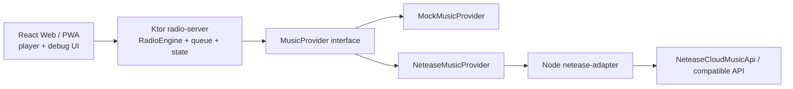

# Aftertaste FM

Aftertaste FM is a private AI radio for turning taste, context, and a small music provider into hosted listening sessions.
Aftertaste FM 是一个私人 AI 电台，用你的音乐品味、当下环境和一个轻量音乐源，生成有主持人的收听节目。

It is not a playlist player that speaks before every track.
它不是那种每首歌前都插一句话的歌单播放器。

It plans small radio segments: a calm AI host opens or transitions a mood, then several songs play together before the host returns.
它会规划一段段电台章节：平静的 AI 主持人负责开场或转场，然后几首歌连续播放，之后主持人再回来。

The project is still in active development, but the core boundary is already deliberate: React is only the player surface, `radio-server` owns planning and state, and provider-specific behavior stays behind adapters.
项目仍在积极开发中，但核心边界已经明确：React 只负责播放器界面，`radio-server` 负责规划和状态，音乐平台相关逻辑都放在 adapter 后面。

## What Runs Today / 当前运行的组成

- `services/radio-server`: Kotlin + Ktor, the main radio brain and public API.
  `services/radio-server`：Kotlin + Ktor，主要的电台大脑和公开 API。
- `apps/web`: React + TypeScript + Vite, a real player/debug surface.
  `apps/web`：React + TypeScript + Vite，真实播放器和调试界面。
- `apps/netease-adapter`: Node + TypeScript, a thin provider adapter with mock data and optional external Netease API pass-through.
  `apps/netease-adapter`：Node + TypeScript，一个很薄的音乐源适配器，支持 mock 数据，也可以转发到外部网易云接口。
- `docs`: architecture, API notes, and roadmap for future contributors and other agents.
  `docs`：架构、API 说明，以及给未来贡献者和其他 agent 看的路线说明。

## Architecture / 架构



React only talks to Ktor.
React 只和 Ktor 通信。

Ktor owns the show plan, playback queue, host language, and future state.
Ktor 负责节目计划、播放队列、主持人语言和后续状态。

The Node adapter is intentionally thin: it hides Netease-specific response shapes and returns Aftertaste FM's normalized `Track`, `StreamUrl`, and `Playlist` objects.
Node adapter 刻意保持很薄：它隐藏网易云特有的返回结构，并返回 Aftertaste FM 统一格式的 `Track`、`StreamUrl` 和 `Playlist` 对象。

## AI Recommendation Shape / AI 推荐流程

The recommendation flow is built around a mock-first local path plus an optional runtime LLM planner:
推荐流程以 mock-first 的本地路径为基础，并可选接入运行时 LLM planner：

1. User chat or "Generate Today's Show" creates a typed recommendation context.
   用户聊天或点击 "Generate Today's Show" 会生成一个类型化的推荐上下文。
2. The context combines prompt intent, host config, taste profile, time, routines, optional weather, and recent listening signals.
   这个上下文会组合用户意图、主持人配置、品味画像、时间、日常习惯、可选天气和最近收听信号。
3. `TasteProfileRepository` loads offline tagged tracks from `data/taste/`.
   `TasteProfileRepository` 会从 `data/taste/` 读取离线标注过的歌曲。
4. `CandidateSelector` picks a small candidate pool from local tags.
   `CandidateSelector` 会从本地标签里挑出一个小候选池。
5. If there is no local taste pool, `MusicProvider` returns candidate tracks from mock data or Netease.
   如果没有本地品味池，`MusicProvider` 会从 mock 数据或网易云返回候选歌曲。
6. `LlmShowPlanner` turns candidates into titled radio segments when a runtime LLM key is set.
   如果配置了运行时 LLM key，`LlmShowPlanner` 会把候选歌曲组织成带标题的电台章节。
7. It receives the selected candidate pool plus compact taste evidence, not the whole listening history.
   它只接收已筛选的候选池和压缩后的品味证据，而不是完整收听历史。
8. `ShowPlanner` remains the deterministic fallback.
   `ShowPlanner` 仍然保留为确定性的本地 fallback。
9. `PlaybackQueue` expands each segment into `HostVoiceItem(with lead Track) + TrackItem + TrackItem`.
   `PlaybackQueue` 会把每个章节展开成 `HostVoiceItem(with lead Track) + TrackItem + TrackItem`。
10. The host can speak over the chapter lead's opening, then the rest of the chapter plays clean.
    主持人可以压在章节 lead track 的开头说话，之后其余歌曲干净播放。
11. The API returns `agentTrace` so the web UI can show how the agent interpreted the request.
    API 会返回 `agentTrace`，让网页端能看到 agent 如何理解这次请求。

This keeps AI recommendation logic in Kotlin while TypeScript handles the UI and provider adapter boundary.
这样 AI 推荐逻辑留在 Kotlin 里，TypeScript 只处理 UI 和音乐源适配边界。

If `LLM_API_KEY` is set, `radio-server` asks the configured LLM to choose segment titles, host scripts, and track groupings from provider candidates.
如果设置了 `LLM_API_KEY`，`radio-server` 会请求配置好的 LLM，从候选歌曲中选择章节标题、主持词和歌曲分组。

The runtime planner supports OpenAI Responses, OpenAI-compatible chat completions, and Anthropic Messages.
运行时 planner 支持 OpenAI Responses、OpenAI-compatible chat completions 和 Anthropic Messages。

When offline taste data exists, the LLM sees compact tags, language, energy/valence scores, night/coding fit, skip risk, and notes for each candidate.
当存在离线品味数据时，LLM 会看到每首候选歌的压缩标签、语言、能量/情绪分数、夜晚/编码适配度、跳过风险和备注。

If the API call fails or no key exists, it falls back to the local planner so the app still runs.
如果 API 调用失败或没有配置 key，系统会回退到本地 planner，保证应用仍然可以运行。

## Offline Taste Data / 离线品味数据

The intended cheap path is to do deeper music analysis offline with GPT, Codex, Claude, lyrics, metadata, and manual edits, then let the app do lightweight selection at runtime.
理想的低成本路径是离线用 GPT、Codex、Claude、歌词、元数据和人工编辑做更深的音乐分析，然后运行时只做轻量选择。

Start with:
先从这里开始：

```bash
cp -R data/taste.example data/taste
```

Then edit:
然后编辑：

- `data/taste/profile.md`: long-term taste notes and host guidance.
  `data/taste/profile.md`：长期品味记录和主持人风格指导。
- `data/taste/rules.json`: mood aliases, default candidate limits, preferred tags, avoid tags.
  `data/taste/rules.json`：情绪别名、默认候选数量、偏好标签和避开标签。
- `data/taste/tracks.evidence.json`: preferred private analysis format. Each tag and score carries confidence and evidence fields.
  `data/taste/tracks.evidence.json`：推荐的私人分析格式；每个标签和分数都带有置信度与证据字段。
- `data/taste/tracks.json`: simple public/example tagged track format.
  `data/taste/tracks.json`：简单的公开示例歌曲标签格式。

`data/taste/` is gitignored because it may contain private listening history.
`data/taste/` 已被 gitignore，因为它可能包含私人收听历史。

The repository only commits `data/taste.example/`.
仓库只提交 `data/taste.example/`。

Runtime priority is:
运行时优先级是：

```text
tracks.evidence.json -> tracks.json -> provider recommendations
```

For accurate recommendations, prefer `tracks.evidence.json`, where lyrics, manual labels, audio features, and listening behavior can raise confidence over time.
为了获得更准确的推荐，优先使用 `tracks.evidence.json`，因为歌词、人工标签、音频特征和收听行为都可以逐步提高置信度。

Do not promote weak title/artist guesses into runtime data unless they are clearly marked as low confidence.
不要把低质量的歌名/歌手猜测直接提升为运行时数据，除非它们被清楚标记为低置信度。

## Importing A Netease Playlist / 导入网易云歌单

Set the adapter to real mode:
把 adapter 设置为真实模式：

```bash
MOCK_NETEASE=false
```

Optional:
可选配置：

```bash
NETEASE_COOKIE=your-cookie
NETEASE_API_BASE=http://localhost:3000
```

If `NETEASE_API_BASE` is empty, the adapter calls the bundled `NeteaseCloudMusicApi` package directly.
如果 `NETEASE_API_BASE` 为空，adapter 会直接调用内置的 `NeteaseCloudMusicApi` 包。

Then run:
然后运行：

```bash
npm run dev:adapter
npm run dev:server
```

Import by playlist URL or id:
用歌单 URL 或 id 导入：

```bash
curl -X POST http://localhost:8080/api/import/playlist \
  -H "Content-Type: application/json" \
  -d '{"source":"https://music.163.com/#/playlist?id=3778678"}'
```

This writes:
这会写入：

- `data/taste/imports/<playlist>.raw.json`
- `data/taste/drafts/<playlist>.tagged-draft.json`
- `data/taste/lyrics/<playlist>.lyrics.json`

Importing does not call the runtime LLM planner.
导入过程不会调用运行时 LLM planner。

The tagged draft is intentionally left for manual or offline analysis before producing `data/taste/tracks.evidence.json`.
标注草稿会刻意保留给人工或离线分析使用，之后再生成 `data/taste/tracks.evidence.json`。

To fetch lyrics through the adapter and build an evidence file:
通过 adapter 获取歌词并构建 evidence 文件：

```bash
NETEASE_ADAPTER_BASE_URL=http://localhost:8090 \
  node scripts/fetch-netease-lyrics.mjs data/taste/drafts/<playlist>.tagged-draft.json

node scripts/build-evidence-analysis.mjs \
  data/taste/drafts/<playlist>.tagged-draft.json
```

The metadata builder is conservative: lyrics and metadata make a track more usable, but low-confidence or ambiguous fields remain marked with `needsReview`.
元数据构建器会保持保守：歌词和元数据会让歌曲更可用，但低置信度或模糊字段仍会标记为 `needsReview`。

For higher-quality offline analysis with a general taxonomy:
如果要用通用分类体系做更高质量的离线分析：

```bash
npm run analyze:playlist -- data/taste/drafts/<playlist>.tagged-draft.json
```

That script uses `LLM_API_KEY` with the OpenAI Responses API and writes `data/taste/tracks.evidence.json`.
该脚本会使用 `LLM_API_KEY` 调用 OpenAI Responses API，并写入 `data/taste/tracks.evidence.json`。

It is designed for arbitrary playlists, not just this first Netease import.
它面向任意歌单设计，不是只服务于第一次网易云导入。

Both evidence scripts update `data/taste/profile.md` and `data/taste/rules.json` after writing `tracks.evidence.json`, so the runtime LLM reads the latest taste profile automatically.
两个 evidence 脚本都会在写入 `tracks.evidence.json` 后更新 `data/taste/profile.md` 和 `data/taste/rules.json`，因此运行时 LLM 会自动读取最新品味画像。

## Local Startup / 本地启动

From the repository root:
在仓库根目录运行：

```bash
cp .env.example .env
```

Start the adapter:
启动 adapter：

```bash
npm --prefix apps/netease-adapter install
npm run dev:adapter
```

Start the radio server:
启动电台服务器：

```bash
npm run dev:server
```

Start the web app:
启动网页应用：

```bash
npm --prefix apps/web install
npm run dev:web
```

Open the Vite URL, usually [http://localhost:5173](http://localhost:5173).
打开 Vite URL，通常是 [http://localhost:5173](http://localhost:5173)。

Or start all three development services from the repository root:
也可以在仓库根目录一次性启动三个开发服务：

```bash
npm run dev
```

This runs:
这会运行：

- `apps/netease-adapter` on `8090`
  `apps/netease-adapter` 运行在 `8090`
- `services/radio-server` on `8080`
  `services/radio-server` 运行在 `8080`
- `apps/web` on `5173`
  `apps/web` 运行在 `5173`

The Kotlin `gradlew` script downloads a local Gradle distribution into the repo cache if Gradle is not installed globally.
如果系统没有全局安装 Gradle，Kotlin 的 `gradlew` 脚本会把本地 Gradle 发行版下载到仓库缓存中。

## Environment / 环境变量

- `HOST_LANGUAGE`: defaults to `en-US`.
  `HOST_LANGUAGE`：默认 `en-US`。
- `HOST_VOICE_STYLE`: defaults to `calm-late-night`.
  `HOST_VOICE_STYLE`：默认 `calm-late-night`。
- `HOST_NAME`: defaults to `Aftertaste`.
  `HOST_NAME`：默认 `Aftertaste`。
- `MUSIC_PROVIDER`: `mock` or `netease`.
  `MUSIC_PROVIDER`：可选 `mock` 或 `netease`。
- `NETEASE_ADAPTER_BASE_URL`: radio-server to adapter URL, default `http://localhost:8090`.
  `NETEASE_ADAPTER_BASE_URL`：radio-server 访问 adapter 的 URL，默认 `http://localhost:8090`。
- `NETEASE_COOKIE`: optional, never commit a real cookie.
  `NETEASE_COOKIE`：可选，永远不要提交真实 cookie。
- `NETEASE_API_BASE`: optional compatible Netease API server for the adapter to call.
  `NETEASE_API_BASE`：可选，供 adapter 调用的兼容网易云 API 服务器。
- `MOCK_NETEASE`: set `true` to force mock mode. Set `false` to use the bundled `NeteaseCloudMusicApi` package, or `NETEASE_API_BASE` if provided.
  `MOCK_NETEASE`：设为 `true` 强制 mock 模式；设为 `false` 会使用内置 `NeteaseCloudMusicApi` 包，或在提供时使用 `NETEASE_API_BASE`。
- `LLM_PROVIDER`: optional runtime planner provider. Use `openai`, `openai-compatible`, or `anthropic`.
  `LLM_PROVIDER`：可选的运行时 planner 提供方，可用 `openai`、`openai-compatible` 或 `anthropic`。
- `LLM_API_KEY`: optional. Enables the LLM show planner and agent chat.
  `LLM_API_KEY`：可选；启用 LLM 节目规划和 agent chat。
- `LLM_BASE_URL`: optional for OpenAI-compatible providers such as Minimax, Qwen, Moonshot, or a local gateway.
  `LLM_BASE_URL`：OpenAI-compatible 提供方可选配置，例如 Minimax、Qwen、Moonshot 或本地网关。
- `LLM_MODEL`: planner model. Defaults to `gpt-5.2` for OpenAI-compatible providers and a Haiku-class default for Anthropic.
  `LLM_MODEL`：planner 模型；OpenAI-compatible 默认 `gpt-5.2`，Anthropic 默认 Haiku 级模型。
- `LLM_CHAT_MODEL`: optional model for ordinary agent chat; defaults to `LLM_MODEL`.
  `LLM_CHAT_MODEL`：普通 agent chat 的可选模型，默认使用 `LLM_MODEL`。
- `LLM_TEMPERATURE`: defaults to `0.75`; higher values give more variation, lower values give more repeatability.
  `LLM_TEMPERATURE`：默认 `0.75`；更高会带来更多变化，更低会更可复现。
- `ANALYSIS_MODEL`: optional model override for the OpenAI-specific offline playlist analysis script.
  `ANALYSIS_MODEL`：OpenAI 专用离线歌单分析脚本的可选模型覆盖。
- `ANALYSIS_BATCH_SIZE`: defaults to `12` tracks per offline analysis call.
  `ANALYSIS_BATCH_SIZE`：默认每次离线分析调用处理 `12` 首歌。
- `LLM_CANDIDATE_LIMIT`: defaults to `30`; caps how many selected tracks are sent to the runtime planner.
  `LLM_CANDIDATE_LIMIT`：默认 `30`，限制发送给运行时 planner 的候选歌曲数量。
- `STATE_DB_PATH`: defaults to `services/radio-server/data/state.db`; stores local messages, plays, generated plans, prefs, and current state.
  `STATE_DB_PATH`：默认 `services/radio-server/data/state.db`，存储本地消息、播放记录、生成计划、偏好和当前状态。
- `OPENWEATHER_API_KEY`: optional. Enables OpenWeather weather context for the saved user location.
  `OPENWEATHER_API_KEY`：可选；为保存的用户位置启用 OpenWeather 天气上下文。
- `OPENWEATHER_UNITS`: defaults to `metric`; weather temperatures are stored in Celsius-oriented fields.
  `OPENWEATHER_UNITS`：默认 `metric`；天气温度以摄氏相关字段存储。
- `FISH_API_KEY`: optional. Enables Fish Audio TTS for host breaks.
  `FISH_API_KEY`：可选；为主持人串场启用 Fish Audio TTS。
- `FISH_VOICE_ID`: optional Fish Audio voice/model id. Recommended for predictable voice quality.
  `FISH_VOICE_ID`：可选的 Fish Audio 声音/模型 id；建议配置以获得稳定音色。
- `FISH_TTS_MODEL`: defaults to `s2-pro`.
  `FISH_TTS_MODEL`：默认 `s2-pro`。
- `FISH_TTS_FORMAT`: defaults to `mp3`.
  `FISH_TTS_FORMAT`：默认 `mp3`。
- `FISH_TTS_LATENCY`: defaults to `normal`.
  `FISH_TTS_LATENCY`：默认 `normal`。
- `FISH_TTS_VOLUME`: defaults to `4.0`; lower it if the generated voice clips or sounds harsh.
  `FISH_TTS_VOLUME`：默认 `4.0`；如果生成声音爆音或刺耳，可以调低。
- `FISH_TTS_CACHE`: defaults to `false`; set `true` only if you want to reuse identical script audio.
  `FISH_TTS_CACHE`：默认 `false`；只有想复用完全相同的主持词音频时才设为 `true`。
- `TTS_CACHE_DIR`: defaults to `cache/tts`; generated audio is served from `/media/tts/<hash>.mp3`.
  `TTS_CACHE_DIR`：默认 `cache/tts`；生成音频会通过 `/media/tts/<hash>.mp3` 提供。

## Why Streaming First / 为什么优先流媒体

Aftertaste FM should not require users to download their whole library.
Aftertaste FM 不应该要求用户下载整个曲库。

The durable data is the user's taste profile, play history, show plans, queue state, TTS cache index, and small metadata.
真正需要持久保存的是用户品味画像、播放历史、节目计划、队列状态、TTS 缓存索引和少量元数据。

Music playback should come from legal platform streams where possible.
音乐播放应尽可能来自合法平台流媒体。

## Host Language Default / 默认主持人语言

The default host voice is deliberately narrow: `en-US`, host name `Aftertaste`, style `calm late-night radio`, and `between_segments` speech.
默认主持人声音刻意保持收窄：`en-US`、主持人名 `Aftertaste`、风格 `calm late-night radio`，并采用 `between_segments` 的说话方式。

That keeps the show-writing behavior coherent while the architecture leaves room for other languages and host styles.
这样可以让节目文案行为保持一致，同时架构上仍给其他语言和主持风格留出空间。

## Netease Risk Note / 网易云风险说明

Netease integration can be unstable and may have account, region, VIP, cookie, or legal constraints.
网易云集成可能不稳定，也可能受到账号、地区、VIP、cookie 或法律限制影响。

Aftertaste keeps it behind an adapter boundary and always keeps a mock path so the product experience still runs when Netease is unavailable.
Aftertaste 会把它放在 adapter 边界之后，并始终保留 mock 路径，保证网易云不可用时产品体验仍能运行。

## Roadmap / 路线图

- Harden the runtime LLM planner response schema and add fixtures.
  加固运行时 LLM planner 的响应 schema，并添加 fixtures。
- Add richer TTS voice controls and optional streaming voice generation.
  增加更丰富的 TTS 声音控制和可选的流式声音生成。
- Add audio features and user behavior to offline analysis.
  把音频特征和用户行为加入离线分析。
- Expand `MusicProvider` implementations: local files, CSV, Spotify, Apple Music, QQ Music.
  扩展 `MusicProvider` 实现：本地文件、CSV、Spotify、Apple Music、QQ Music。
- Add `zh-CN` host language support.
  增加 `zh-CN` 主持人语言支持。
- Add WebSocket now-playing push and richer progress tracking.
  增加 WebSocket now-playing 推送和更丰富的进度追踪。
- Package the web app as a PWA, then explore Mac/iPhone shells.
  把网页应用打包成 PWA，然后探索 Mac/iPhone 外壳。

## Current Limits / 当前限制

Mock tracks intentionally have no playable stream URLs, so the queue and radio flow can be tested without platform credentials.
Mock 歌曲刻意不提供可播放 stream URL，这样可以在没有平台凭证的情况下测试队列和电台流程。

The UI handles unavailable media and lets you continue through the show.
UI 会处理不可用媒体，并允许你继续推进节目。
