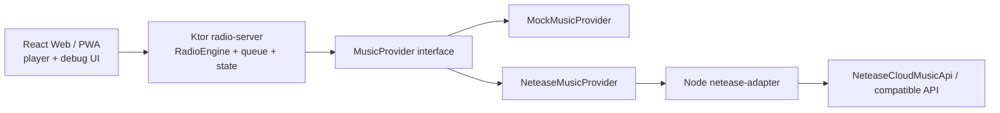

# Aftertaste FM

Aftertaste FM is a private AI radio prototype. It is not a playlist player that speaks before every track. It plans small radio segments: a calm AI host opens or transitions a mood, then several songs play together before the host returns.

v0.1 is built for one person first, but the repository is shaped so it can become an open source project later.

## What Runs Today

- `services/radio-server`: Kotlin + Ktor, the main radio brain and public API.
- `apps/web`: React + TypeScript + Vite, a real player/debug surface.
- `apps/netease-adapter`: Node + TypeScript, a thin provider adapter with mock data and optional external Netease API pass-through.
- `docs`: architecture, API notes, and roadmap for future contributors and other agents.

## Architecture



React only talks to Ktor. Ktor owns the show plan, playback queue, host language, and future state. The Node adapter is intentionally thin: it hides Netease-specific response shapes and returns Aftertaste FM's normalized `Track`, `StreamUrl`, and `Playlist` objects.

## AI Recommendation Shape

v0.1 has a mock `RadioAgent`, but the boundary is already in place:

1. User chat or "Generate Today's Show" creates a typed recommendation context.
2. The context combines prompt intent, host config, taste profile, time, routines, optional weather, and recent listening signals.
3. `TasteProfileRepository` loads offline tagged tracks from `data/taste/`.
4. `CandidateSelector` picks a small candidate pool from local tags.
5. If there is no local taste pool, `MusicProvider` returns candidate tracks from mock data or Netease.
6. `LlmShowPlanner` turns candidates into titled radio segments when `OPENAI_API_KEY` is set. It receives the selected candidate pool plus compact taste evidence, not the whole listening history.
7. `ShowPlanner` remains the deterministic fallback.
8. `PlaybackQueue` expands each segment into `HostVoiceItem(with lead Track) + TrackItem + TrackItem`. The host can speak over the chapter lead's opening, then the rest of the chapter plays clean.
9. The API returns `agentTrace` so the web UI can show how the agent interpreted the request.

This keeps AI recommendation logic in Kotlin while TypeScript handles the UI and provider adapter boundary.

If `OPENAI_API_KEY` is set, `radio-server` asks the LLM to choose segment titles, host scripts, and track groupings from provider candidates. When offline taste data exists, the LLM sees compact tags, language, energy/valence scores, night/coding fit, skip risk, and notes for each candidate. If the API call fails or no key exists, it falls back to the deterministic planner so the app still runs.

## Offline Taste Data

The intended cheap path is to do deeper music analysis offline with GPT, Codex, Claude, lyrics, metadata, and manual edits, then let the app do lightweight selection at runtime.

Start with:

```bash
cp -R data/taste.example data/taste
```

Then edit:

- `data/taste/profile.md`: long-term taste notes and host guidance.
- `data/taste/rules.json`: mood aliases, default candidate limits, preferred tags, avoid tags.
- `data/taste/tracks.evidence.json`: preferred private analysis format. Each tag and score carries confidence and evidence fields.
- `data/taste/tracks.json`: simple public/example tagged track format.

`data/taste/` is gitignored because it may contain private listening history. The repository only commits `data/taste.example/`.

Runtime priority is:

```text
tracks.evidence.json -> tracks.json -> provider recommendations
```

For accurate recommendations, prefer `tracks.evidence.json`, where lyrics, manual labels, audio features, and listening behavior can raise confidence over time. Do not promote weak title/artist guesses into runtime data unless they are clearly marked as low confidence.

## Importing A Netease Playlist

Set the adapter to real mode:

```bash
MOCK_NETEASE=false
```

Optional:

```bash
NETEASE_COOKIE=your-cookie
NETEASE_API_BASE=http://localhost:3000
```

If `NETEASE_API_BASE` is empty, the adapter calls the bundled `NeteaseCloudMusicApi` package directly. Then run:

```bash
npm run dev:adapter
npm run dev:server
```

Import by playlist URL or id:

```bash
curl -X POST http://localhost:8080/api/import/playlist \
  -H "Content-Type: application/json" \
  -d '{"source":"https://music.163.com/#/playlist?id=3778678"}'
```

This writes:

- `data/taste/imports/<playlist>.raw.json`
- `data/taste/drafts/<playlist>.tagged-draft.json`
- `data/taste/lyrics/<playlist>.lyrics.json`

Importing does not call the runtime LLM planner. The tagged draft is intentionally left for manual or offline analysis before producing `data/taste/tracks.evidence.json`.

To fetch lyrics through the adapter and build an evidence file:

```bash
NETEASE_ADAPTER_BASE_URL=http://localhost:8090 \
  node scripts/fetch-netease-lyrics.mjs data/taste/drafts/<playlist>.tagged-draft.json

node scripts/build-evidence-analysis.mjs \
  data/taste/drafts/<playlist>.tagged-draft.json
```

The metadata builder is conservative: lyrics and metadata make a track more usable, but low-confidence or ambiguous fields remain marked with `needsReview`.

For higher-quality offline analysis with a general taxonomy:

```bash
npm run analyze:playlist -- data/taste/drafts/<playlist>.tagged-draft.json
```

That script uses `OPENAI_API_KEY` and writes `data/taste/tracks.evidence.json`. It is designed for arbitrary playlists, not just this first Netease import.

Both evidence scripts update `data/taste/profile.md` and `data/taste/rules.json` after writing `tracks.evidence.json`, so the runtime LLM reads the latest taste profile automatically.

## Local Startup

From the repository root:

```bash
cp .env.example .env
```

Start the adapter:

```bash
npm --prefix apps/netease-adapter install
npm run dev:adapter
```

Start the radio server:

```bash
npm run dev:server
```

Start the web app:

```bash
npm --prefix apps/web install
npm run dev:web
```

Open the Vite URL, usually [http://localhost:5173](http://localhost:5173).

Or start all three development services from the repository root:

```bash
npm run dev
```

This runs:

- `apps/netease-adapter` on `8090`
- `services/radio-server` on `8080`
- `apps/web` on `5173`

The Kotlin `gradlew` script in this prototype downloads a local Gradle distribution into the repo cache if Gradle is not installed globally.

## Environment

- `HOST_LANGUAGE`: defaults to `en-US`.
- `HOST_VOICE_STYLE`: defaults to `calm-late-night`.
- `HOST_NAME`: defaults to `Aftertaste`.
- `MUSIC_PROVIDER`: `mock` or `netease`.
- `NETEASE_ADAPTER_BASE_URL`: radio-server to adapter URL, default `http://localhost:8090`.
- `NETEASE_COOKIE`: optional, never commit a real cookie.
- `NETEASE_API_BASE`: optional compatible Netease API server for the adapter to call.
- `MOCK_NETEASE`: set `true` to force mock mode. Set `false` to use the bundled `NeteaseCloudMusicApi` package, or `NETEASE_API_BASE` if provided.
- `OPENAI_API_KEY`: optional. Enables the LLM show planner.
- `OPENAI_MODEL`: defaults to `gpt-5.2`.
- `OPENAI_CHAT_MODEL`: optional model for ordinary agent chat; defaults to `OPENAI_MODEL`.
- `OPENAI_ANALYSIS_MODEL`: optional model override for offline playlist analysis.
- `ANALYSIS_BATCH_SIZE`: defaults to `12` tracks per offline analysis call.
- `LLM_CANDIDATE_LIMIT`: defaults to `30`; caps how many selected tracks are sent to the runtime planner.
- `OPENWEATHER_API_KEY`: optional. Enables OpenWeather weather context for the saved user location.
- `OPENWEATHER_UNITS`: defaults to `metric`; weather temperatures are stored in Celsius-oriented fields.
- `FISH_API_KEY`: optional. Enables Fish Audio TTS for host breaks.
- `FISH_VOICE_ID`: optional Fish Audio voice/model id. Recommended for predictable voice quality.
- `FISH_TTS_MODEL`: defaults to `s2-pro`.
- `FISH_TTS_FORMAT`: defaults to `mp3`.
- `FISH_TTS_LATENCY`: defaults to `normal`.
- `FISH_TTS_VOLUME`: defaults to `4.0`; lower it if the generated voice clips or sounds harsh.
- `FISH_TTS_CACHE`: defaults to `false`; set `true` only if you want to reuse identical script audio.
- `TTS_CACHE_DIR`: defaults to `cache/tts`; generated audio is served from `/media/tts/<hash>.mp3`.

## Why Streaming First

Aftertaste FM should not require users to download their whole library. The durable data is the user's taste profile, play history, show plans, queue state, TTS cache index, and small metadata. Music playback should come from legal platform streams where possible.

## Why English Host in v0.1

The first host voice is deliberately narrow: `en-US`, host name `Aftertaste`, style `calm late-night radio`, and `between_segments` speech. That keeps the show-writing behavior coherent while the architecture leaves room for `zh-CN` later.

## Netease Risk Note

Netease integration can be unstable and may have account, region, VIP, cookie, or legal constraints. v0.1 treats it as an adapter boundary and always keeps a mock path so the product experience still runs when Netease is unavailable.

## Roadmap

- Add SQLite persistence.
- Harden the OpenAI LLM planner response schema and add fixtures.
- Add richer TTS voice controls and optional streaming voice generation.
- Add audio features and user behavior to offline analysis.
- Expand `MusicProvider` implementations: local files, CSV, Spotify, Apple Music, QQ Music.
- Add `zh-CN` host language support.
- Add WebSocket now-playing push and richer progress tracking.
- Package the web app as a PWA, then explore Mac/iPhone shells.

## Current Prototype Limits

This is a v0.1 prototype. Mock tracks intentionally have no playable stream URLs, so the queue and radio flow can be tested without platform credentials. The UI handles unavailable media and lets you continue through the show.
