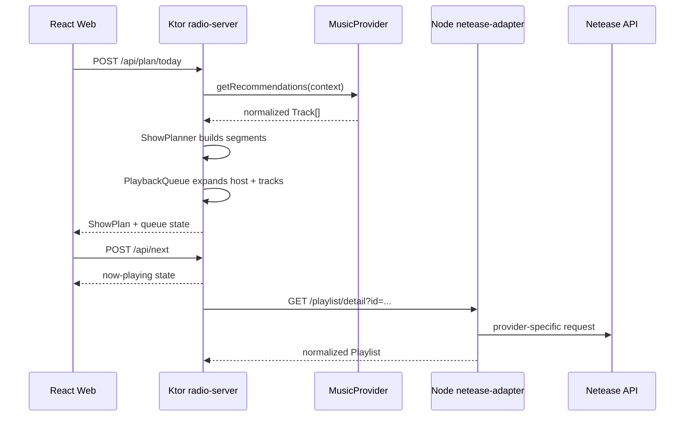
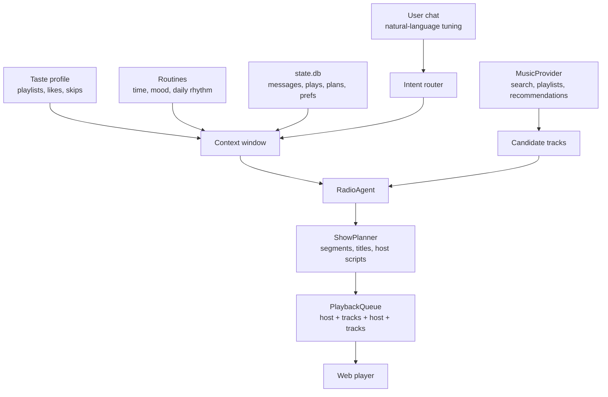

# Architecture

Aftertaste FM uses a small monorepo so the product can run locally while keeping clear provider boundaries.

## Runtime Shape



## Core Concepts

- `RadioAgent`: the AI orchestration layer. It turns chat, taste profile, routines, time, weather, and provider results into a planning context. v0.1 can use a configured runtime LLM planner and returns an `AgentTrace` so the UI can show what happened.
- `TasteProfileRepository`: loads offline profile, rules, and tagged tracks from `data/taste/`, falling back to `data/taste.example/`.
- `CandidateSelector`: scores tagged tracks against the current request and returns a small candidate pool for the planner.
- `ShowPlan`: title, date, host config, and multiple `ShowSegment` values.
- `ShowSegment`: one chapter title, one `hostScript`, and 3-6 tracks. The first track is the chapter lead for host voice-over.
- `PlaybackQueue`: flattened playable order. Host voice is an item, but it is not attached to every track.
- `MusicProvider`: the only interface the radio brain uses for music data.
- `HostVoiceService`: generates and synthesizes host scripts. v0.1 has mock TTS and returns text/cache keys.

## AI Recommendation Pipeline

The recommendation system follows the "construction diagram" mental model:



v0.1 implementation:

- `RadioAgent.buildContext(...)` extracts simple signals from the prompt, such as quiet energy, late-night coding, Chinese indie, or "less sad".
- `StateStore` writes local memory to SQLite `state.db`: current app state, recent messages, play events, generated plans, and prefs.
- `TasteProfileRepository` loads offline tagged tracks.
- `CandidateSelector` ranks those tracks by tags, language, energy, valence, night score, coding score, and skip risk.
- `MusicProvider.getRecommendations(context)` returns normalized candidate tracks only when no local taste pool exists.
- `LlmShowPlanner` can use OpenAI Responses, OpenAI-compatible chat completions, or Anthropic Messages when a runtime LLM key is configured.
- `ShowPlanner` groups candidates into segment-sized batches as the fallback.
- `HostVoiceService` writes one English host script per segment.
- `PlaybackQueue` expands the show into host and track items.
- `PlanResponse.agentTrace` exposes the reasoning path to the UI.

Future implementation:

- Replace signal extraction with an LLM router that returns typed JSON.
- Load routine files into the context window.
- Add a ranking stage that scores candidate tracks by taste fit, novelty, energy, language, recency, and skip history.
- Pass only the selected candidate pool and compact evidence summary to the runtime LLM, not full raw imports or full lyrics.
- Keep the same queue invariant: the host speaks once per chapter, usually over the lead track opening, not before every track.

## Provider Boundary

The Kotlin server defines:

- `search(query)`
- `getTrack(trackId)`
- `getStreamUrl(trackId)`
- `getLyrics(trackId)`
- `getPlaylist(playlistId)`
- `getRecommendations(context)`

`MockMusicProvider` runs without credentials. `NeteaseMusicProvider` calls the Node adapter over HTTP. Future providers should implement the same interface without changing `RadioEngine` or the React app.

## Playlist Import

`POST /api/import/playlist` is deliberately separate from runtime recommendation. It accepts a Netease playlist URL or id, fetches normalized metadata through the strict Netease import provider, and writes:

- `data/taste/imports/<playlist>.raw.json`
- `data/taste/drafts/<playlist>.tagged-draft.json`
- `data/taste/lyrics/<playlist>.lyrics.json`

The tagged draft starts with empty tags and neutral scores. A human, Codex, GPT, or Claude can edit/analyze that draft offline, then selected tracks can be promoted into `data/taste/tracks.evidence.json`.

Runtime taste loading prefers evidence over guesses:

```text
tracks.evidence.json -> tracks.json
```

`tracks.evidence.json` is the accurate path. Every language label, mood tag, usage tag, and score can include confidence and evidence such as `lyrics`, `metadata`, `manual`, `audioFeatures`, or `userBehavior`. Weak title/artist guesses should either stay out of runtime data or remain explicitly low confidence.

Offline helper scripts:

- `scripts/fetch-netease-lyrics.mjs`: fills the playlist lyrics cache through the adapter.
- `scripts/build-evidence-analysis.mjs`: combines draft metadata and lyrics into the v2 evidence schema.
- `scripts/analyze-playlist-openai.mjs`: uses a general OpenAI-based music taxonomy to produce higher-confidence evidence across arbitrary playlists.
- `scripts/build-taste-profile.mjs`: rebuilds `profile.md` and `rules.json` from `tracks.evidence.json`.

The analyzer prompt should stay provider-agnostic. Do not add categories that only make sense for one imported playlist.

The Node adapter supports three modes:

- `mock`: forced by `MOCK_NETEASE=true`.
- `external-api`: uses `NETEASE_API_BASE`.
- `local-package`: uses the bundled `NeteaseCloudMusicApi` npm package when `MOCK_NETEASE=false` and no external base URL is configured.

## State And Memory

Runtime state and memory live in `services/radio-server/data/state.db` by default. The database is intentionally local and private. It has small, explicit tables that match the construction diagram:

- `app_state`: the current show plan, queue, and settings snapshot.
- `messages`: recent user and agent messages.
- `plays`: play, pause, next, and previous events with compact track metadata.
- `plans`: generated show plans as JSON for audit and later retrieval.
- `prefs`: user preferences such as weather location.

Prompt construction does not send the whole database. `RadioEngine` retrieves a small memory window from `StateStore.recentMemory()` and adds it to `RecommendationContext.recentSignals`; the LLM planner receives only those compact fragments plus the selected candidate pool.

## Host Language

English is fully supported first. `zh-CN` is reserved in config and models, but the v0.1 writing style and mock planner are tuned for `en-US`.
